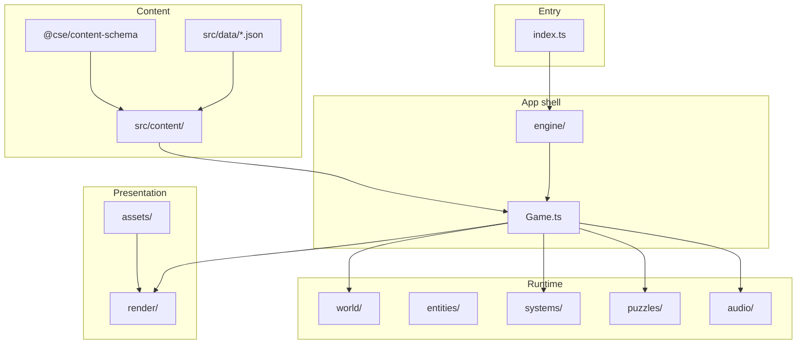

# Architecture

A pixel-art murder mystery built with **TypeScript**, **Vite**, and **Canvas 2D**. Content is JSON-driven; runtime art is procedurally generated. No runtime npm dependencies.

## Boot flow

```
index.html → src/index.ts
  ├── validateContentAtStartup()   (dev only)
  ├── spriteLoader.load()
  └── Loop (requestAnimationFrame)
        ├── main_menu / intro / pause  → Menu, IntroScreen
        └── playing                    → Game.update() + Game.render()
```

`Game` (`src/engine/Game.ts`) is constructed when the player starts a case. It loads rooms/NPCs from JSON, applies the active story (if valid), builds tile maps, and runs gameplay systems.

## Layer diagram



## Directory guide

| Path | Role |
|------|------|
| [`packages/content-schema/`](packages/content-schema/) | Shared types, placement math, validation |
| [`src/data/`](src/data/) | Rooms, NPCs, furniture, clues, stories (authoritative content) |
| [`src/content/`](src/content/) | Loaders (`loadCatalog`, `loadGameContent`), story application |
| [`src/engine/`](src/engine/) | App shell: `Loop`, `Menu`, `IntroScreen`, `Input`, `Game` coordinator |
| [`src/world/`](src/world/) | `Room`, `TileMap`, room factory (`Rooms.ts`), NPC spawn |
| [`src/entities/`](src/entities/) | `Player`, `NPC` |
| [`src/systems/`](src/systems/) | Clue, dialog, interaction, room transitions, chase, victory, attic mice |
| [`src/puzzles/`](src/puzzles/) | Study/cellar secret puzzles, confirm/unlock registry |
| [`src/render/`](src/render/) | `roomScene`, tile drawing, HUD overlays |
| [`src/assets/`](src/assets/) | `SpriteLoader`, `SpriteMap`, procedural generators |
| [`src/assets/procedural/`](src/assets/procedural/) | Procedural sprite generators (see dual-path below) |
| [`src/audio/`](src/audio/) | Footsteps, ambience, talk/clue SFX |
| [`src/editor/`](src/editor/) | Level/case editor (separate Vite entry) |

## Rendering model

There is **no scene graph**. Rooms are drawn on Canvas 2D in explicit passes inside [`src/render/roomScene.ts`](src/render/roomScene.ts):

1. Floor/wall tiles
2. Doors and rugs
3. Y-sorted `DepthActor`s (furniture + NPCs)
4. Overhead decor

Layer ordering uses [`src/render/renderLayers.ts`](src/render/renderLayers.ts).

## Procedural art (two paths)

| Path | When to use | Examples |
|------|-------------|----------|
| **Registry bake** | Static sprites baked at load via [`registry.ts`](src/assets/procedural/registry.ts) | tiles, characters, furniture, garden, animals |
| **Runtime custom draw** | Sprites needing animation or wall-context at draw time | `fireplace`, `fountain`, `oil_lamp`, `attic_mouse`, `wall_align` |

Registry sprites must be listed in [`packages/content-schema/src/sprites.ts`](packages/content-schema/src/sprites.ts). Custom-draw modules are imported directly from `roomScene.ts`. See [`src/assets/procedural/AGENTS.md`](src/assets/procedural/AGENTS.md).

## Adding content

### New room

1. Create `src/data/rooms/<id>.json` (see existing rooms for shape).
2. Add display title in `ROOM_DISPLAY_TITLES` in [`src/engine/Game.ts`](src/engine/Game.ts) if needed.
3. Run `pnpm validate`.
4. No other TypeScript changes required — rooms are auto-discovered via `import.meta.glob`.

### New NPC

1. Create `src/data/npcs/<id>.json`.
2. Place the NPC in a room JSON file (`npcs` array).
3. Run `pnpm validate`.

### New furniture / sprite

1. Add sprite name to [`packages/content-schema/src/sprites.ts`](packages/content-schema/src/sprites.ts).
2. Add procedural definition in [`src/assets/procedural/`](src/assets/procedural/) (registry or custom draw).
3. Add furniture entry in `src/data/furniture/` (single file or `decorations.json` map).
4. Reference `furnitureId` in room JSON.

### New story case

Author in the editor (`pnpm dev:editor:full`) or edit `src/data/story/generated/stories/active.json`. See [`src/editor/README.md`](src/editor/README.md).

## Validation & tests

| When | Command / trigger |
|------|-------------------|
| CI / manual | `pnpm validate` |
| Type check | `pnpm typecheck` |
| Unit tests | `pnpm test` |
| Dev game startup | Console warnings via `validateContentAtStartup()` |
| Editor UI | Validate buttons |
| Editor room save | Backend runs `validateRooms` |

Tests live alongside source (`*.test.ts` in `systems/`, `puzzles/`, `render/`, and `packages/content-schema/`).

## Editor vs runtime

- **Game** (`pnpm dev`) reads bundled JSON only; no file backend.
- **Editor** (`pnpm dev:editor:full`) shares `renderRoomScene` and `createRoomFromConfig` for preview parity.
- Production ships the game entry and `src/data/**` only.

## Key design choices

- **Not ECS** — small OOP layers with `Game` as coordinator.
- **Shared schema package** — one source of truth for types and validation across game, editor, and CLI.
- **Data-driven puzzles** — furniture can declare `interactionType: "confirm"`; exits can declare `requiresUnlock` and `skipDoorSprite`.

## Agent instructions

Portable agent docs live in [`AGENTS.md`](AGENTS.md) (root and nested). Content reference: [`GAME_REFERENCE.md`](GAME_REFERENCE.md).
