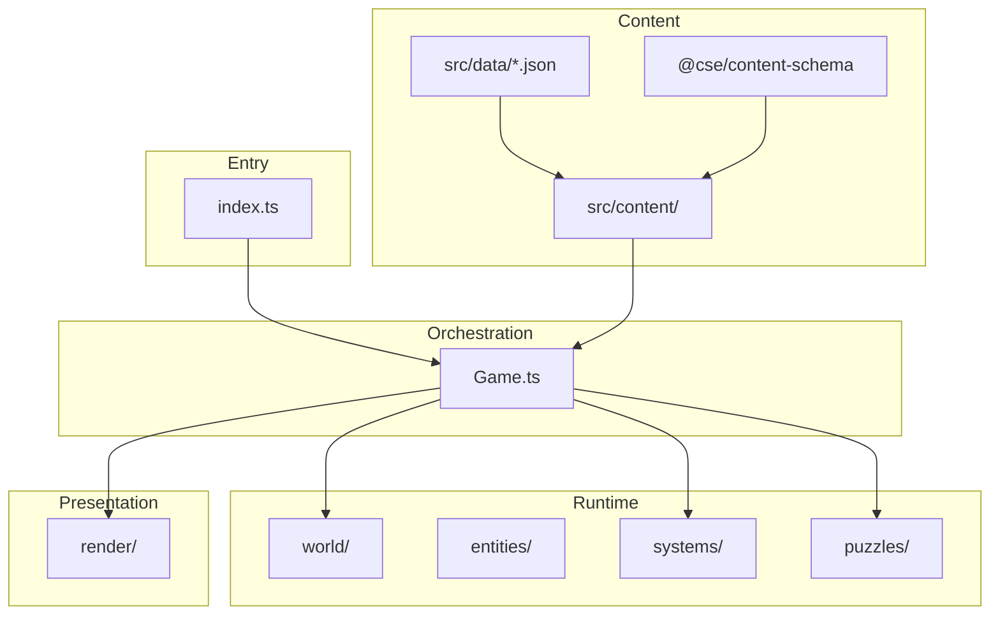

# Architecture

A pixel-art murder mystery built with **TypeScript**, **Vite**, and **Canvas 2D**. Content is JSON-driven; runtime art is procedurally generated.

## Boot flow

```
index.html → src/index.ts
  ├── validateContentAtStartup()   (dev only)
  ├── spriteLoader.load()
  └── Loop (requestAnimationFrame)
        ├── main_menu / intro / pause  → Menu, IntroScreen
        └── playing                    → Game.update() + Game.render()
```

`Game` is constructed when the player starts a case. It loads rooms/NPCs from JSON, applies the active story (if valid), builds tile maps, and runs gameplay systems.

## Layer diagram



## Directory guide

| Path | Role |
|------|------|
| [`packages/content-schema/`](packages/content-schema/) | Shared types, placement math, validation |
| [`src/data/`](src/data/) | Rooms, NPCs, furniture, clues, stories (authoritative content) |
| [`src/content/`](src/content/) | Loaders (`loadCatalog`, `loadGameContent`), story application |
| [`src/world/`](src/world/) | `Room`, `TileMap`, room factory (`Rooms.ts`), NPC spawn |
| [`src/entities/`](src/entities/) | `Player`, `NPC` |
| [`src/systems/`](src/systems/) | Clue, dialog, interaction, room transitions, chase, victory |
| [`src/puzzles/`](src/puzzles/) | Puzzle handlers (e.g. study secret bookshelf) |
| [`src/render/`](src/render/) | `roomScene`, tile drawing, HUD overlays |
| [`src/assets/procedural/`](src/assets/procedural/) | Procedural sprite generators |
| [`src/editor/`](src/editor/) | Level/case editor (separate Vite entry) |

## Adding content

### New room

1. Create `src/data/rooms/<id>.json` (see existing rooms for shape).
2. Run `pnpm validate`.
3. No TypeScript changes required — rooms are auto-discovered via `import.meta.glob`.

### New NPC

1. Create `src/data/npcs/<id>.json`.
2. Place the NPC in a room JSON file (`npcs` array).
3. Run `pnpm validate`.

### New furniture / sprite

1. Add sprite name to [`packages/content-schema/src/sprites.ts`](packages/content-schema/src/sprites.ts).
2. Add procedural definition in [`src/assets/procedural/`](src/assets/procedural/).
3. Add furniture entry in `src/data/furniture/` (single file or `decorations.json` map).
4. Reference `furnitureId` in room JSON.

### New story case

Author in the editor (`pnpm dev:editor:full`) or edit `src/data/story/generated/stories/active.json`. See [`src/editor/README.md`](src/editor/README.md).

## Validation

| When | Command / trigger |
|------|-------------------|
| CI | `pnpm validate` |
| Dev game startup | Console warnings via `validateContentAtStartup()` |
| Editor UI | Validate buttons |
| Editor room save | Backend runs `validateRooms` |

## Editor vs runtime

- **Game** (`pnpm dev`) reads bundled JSON only; no file backend.
- **Editor** (`pnpm dev:editor:full`) shares `renderRoomScene` and `createRoomFromConfig` for preview parity.
- Production ships the game entry and `src/data/**` only.

## Key design choices

- **Not ECS** — small OOP layers with `Game` as coordinator.
- **Shared schema package** — one source of truth for types and validation across game, editor, and CLI.
- **Data-driven puzzles** — furniture can declare `interactionType: "confirm"`; exits can declare `requiresUnlock` and `skipDoorSprite`.
